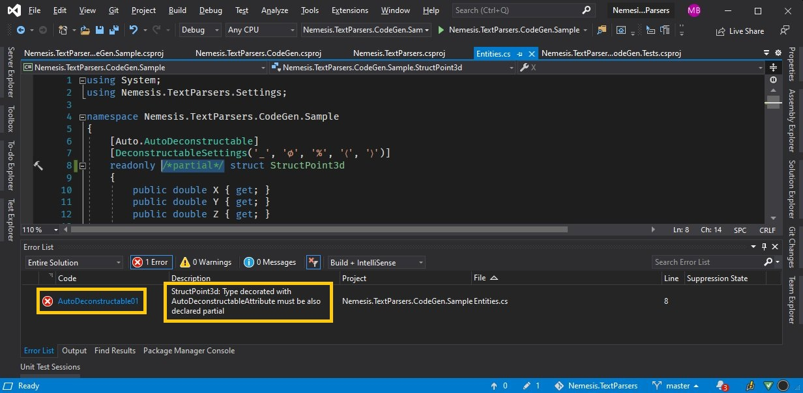

#  Nemesis.TextParsers

***

## Synopsis
This library aims at providing means to format to (serialize) and parse from (deserialize) various common types and complex types to flat human-readable / human-editable texts. Conciseness and performance are the name of the game here and with such features in mind this library was designed. 
Generally it's not possible to heavily influence message format, but library tries to be able to serialize most use cases. Serialization can be affected to certain degree using settings. User can register own transformers or use build-in conventions and aspects. The following catalogue lists down convention, defaults and formats. They are listed in descending order of precedence down the chain of responsibility pattern that lies at heart of parsing library. Aspects are marked with **strong emphasis**.
*Compound parser* means that it employs inner value parser and adds own logic i.e. list parser will tokenize input, unescape escaped sequences and use appropriate inner parser 

When it's not marked otherwise, library follows Postel's Law (formatting is done by the book and best effort is used for parsing): 
> Be liberal in what you accept, and conservative in what you send.

## Serialization format 
General rules
1. Default value can always be enforced using '∅' character. Where it's not relevant - whitespace are trimmed upon parsing, 
2. Escaping sequences are supported – each parser/formatter might use different set of escaping sequences and it escapes/unescape only characters of its interest.  As a rule of thumb, special characters are escaped with backslash ('\\') and backslash itself is escaped with double backslash.
3. Recognized types can be arbitrarily embedded/mixed i.e. it's possible to parse/format ```SortedDictionary<char?, IList<float[][]>>``` with no hiccups
4. Serialization grammar discovery is possible using TextConverterSyntax.GetSyntaxFor method i.e.
```csharp
var actual = TextSyntaxProvider.Default.GetSyntaxFor(AggressionBased3<Dictionary<uint, System.IO.FileMode?>>);	
Assert.That(actual, Is.EqualTo(@"Hash ('#') delimited list with 1 or 3 (passive, normal, aggressive) elements i.e. 1#2#3
escape '#' with ""\#"" and '\' by doubling it ""\\""

AggressionBased3`1 elements syntax:
	KEY=VALUE pairs separated with ';' bound with nothing and nothing i.e.
	key1=value1;key2=value2;key3=value3
	(escape '=' with ""\="", ';' with ""\;"", '∅' with ""\∅"" and '\' by doubling it ""\\"")
	Key syntax:
		Whole number from 0 to 4294967295
	Value syntax:
		One of following: CreateNew, Create, Open, OpenOrCreate, Truncate, Append or null"));
```

###	Simple types 
Generally, not affected by custom settings, parsed using InvariantCulture. The following types are supported: 
1. string – no special border characters (i.e ' or ") are needed. Empty string is serialized to empty string. No inner escaping sequences are supported – but every UTF-16 character is recognized 
2. bool – case insensitive True or False literals 
3. char - single UTF-16 character
4. Numbers (byte, sbyte, short, ushort, int, uint, long, ulong, float, double, decimal) are formatted in default roundtrip format with InvariantCulture
5. Several build-in types are formatted using InvariantCulture and the following format
   * TimeSpan – null
   * DateTime/ DateTimeOffset - o
   * Guid – D
   * BigInteger – R
6. Version - integers separated with dots
7. IpAddress - valid integers separated with dots
8. Complex – semicolon separated and parenthesis bound two numbers (real and imaginary part) i.e. *(3.14; 2)* which translates to *π+2ⅈ*
9. Regex - option and pattern serialized in [Deconstructables fashion](#deconstructables) - separated with ';', escaped with '~' (to avoid overescaping of already frequent '\' escaping character in regex format), bounded by curly braces ('{', '}'). Options serialized using regex option format (flag combination specified without separators i.e. ``` "mi" == RegexOptions.Multiline | RegexOptions.IgnoreCase ```):
   * RegexOptions.None → '0'
   * RegexOptions.IgnoreCase → 'i'
   * RegexOptions.Multiline → 'm'
   * RegexOptions.ExplicitCapture → 'n'
   * RegexOptions.Compiled → 'c'
   * RegexOptions.Singleline → 's'
   * RegexOptions.IgnorePatternWhitespace → 'x'
   * RegexOptions.RightToLeft → 'r'
   * RegexOptions.ECMAScript → 'e'
   * RegexOptions.CultureInvariant → 'v' 
   * RegexOptions.NonBacktracking → 'b'


### KeyValuePair<,> (compound parser)
Key and value formatted using appropriate inner formatter, and separated with = i.e. *1=One*. 

Format can be customized using settings


### ValueTuples (compound parser)
Tuples of any arity  - colon separated and parenthesis-bound elements formatted using appropriate inner formatter i.e. *(1,ABC,10000000000)*. 

While generally possible, one might be tempted to format/parse octuples and larger tuples, it might be considered a bad practice. From octuple values must be enclosed in their own set of parenthesis to follow .net convention that that is i.e. nonuple is in fact septuple and double bound together. So tuple with 10 numbers will have to be formatted like so *(1,2,3,4,5,6,7,(8,9,10))*. User might however consider implementing own container (with own transformer or other method of transformation) type for this purpose. 

Format can be customized using settings

### Transformables aspect
User can register his own transformer. More on this topic in [Transformables](#transformables) section below. 

### FactoryMethod 
(legacy) It is possible to use type's ```ToString``` method for formatting and static ```FromText(ReadOnlySpan<char> text)``` or ```FromText(string text)``` method for parsing. If given entity's code is not owned at parsing point, it's possible to provide separate FactoryMethod transformer 

### Enums 
By default, enums are parsed with case insensitive parser and numbers are allowed but format can be customized using settings. 
Enums are parsed using Expression Trees but can also be parsed using [source code generators](https://github.com/dotnet/roslyn/blob/main/docs/features/incremental-generators.md). 
More on that [below](#source-code-generators)


### Nullable (compound parser)
Values formatted using internal value parser, empty string is parsed as "no value"/null


### Dictionary (compound parsers)
*key1=value1;key2=value2*

Generic realizations of following types are supported: ```Dictionary<,>, IDictionary<,>, ReadOnlyDictionary<,>, IReadOnlyDictionary<,>, SortedList<,>, SortedDictionary<,>```

Moreover user can automatically parse his custom dictionary-like data structures provided that they implement ```IDictionary<,>``` while providing empty public constructor or implement ```IReadOnlyDictionary<,>``` while having public constructor that accepts ```IDictionary<,>``` realized using same generic parameters  

Format can be customized using settings.

### Collections (compound parsers)
Generally parsed as separated with '|' and optionally enclosed in brackets/braces etc. 
1. Array - single dimension and jagged arrays are supported 
2. Collections - Generic realizations of following types are supported: ```IEnumerable<>, ICollection<>, IList<>, List<>, IReadOnlyCollection<>, IReadOnlyList<>, ReadOnlyCollection<>, ISet<>, SortedSet<>, HashSet<>, LinkedList<>, Stack<>, Queue<>, ObservableCollection<>, ReadOnlyObservableCollection<>```
3. LeanCollection -  LeanCollection type is a discriminated union that conveniently stashes 1,2,3 or more types (for performance reasons) but they are formatted like normal collections 
4. Custom collection - in addition to that user can automatically parse his custom collection-like data structures provided that they implement ```ICollection<>``` while providing empty public constructor or implement ```IReadOnlyCollection<>``` while having public constructor that accepts ```IList<>``` realized using same generic parameters
5. ArraySegment<> serialized in [Deconstructables fashion](#deconstructables) - separated with '@', escaped with '~', bounded by curly braces ('{', '}'). Serialized parts are (in order of occurrence): offset, count, array


Format can be customized using settings - separately for arrays and other collections.

### Deconstructables aspect
Values can be formatted automatically using deconstructor and parsed using matching constructor's metadata. More on this topic in [Deconstructables](#deconstructables) section below. Format can be customized using settings. 


### TypeConverters (for legacy reasons) 
If all else fails, ```System.ComponentModel.TypeConverter``` is used to format/parse provided that given converter supports parsing from/to string. Due to inherent lack of ability to box ReadOnlySpan - it cannot be used for parsing using this method. As a result, performance might be slightly degraded.

## Transformables
Study how the following code presents features and possibilities of **Transformable** aspect
```csharp
//1. Transformer can be registered on concrete implementation (class/struct) but also on interfaces/base classes 
[Transformer(typeof(CustomListTransformer<>))] 
//2. transformer registration can also be open generic - generic parameter is provided from transformed types 
internal interface ICustomList<TElement> : IEnumerable<TElement>, IEquatable<ICustomList<TElement>>
{    bool IsNullContent { get; }   }

//3. concrete implementation does not need to register separate transformers, but it will only "inherit" transformers from it's base types, not interfaces 
internal class CustomList<TElement> : ICustomList<TElement>, IEquatable<ICustomList<TElement>>
{
    private readonly IReadOnlyCollection<TElement> _collection;
    public bool IsNullContent => _collection == null;
    public CustomList(IReadOnlyCollection<TElement> collection) =>_collection = collection;

    public IEnumerator<TElement> GetEnumerator() => _collection ?? Enumerable.Empty<TElement>()).GetEnumerator);
    IEnumerator IEnumerable.GetEnumerator() => GetEnumerator();
    /*...*/
}

internal class CustomListTransformer<TElement> : TransformerBase<ICustomList<TElement>>
{
    //4. Transformable aspect supports simple injection of ITransformerStore via it's constructor  
    //   User can thus use other transformers already registered for simple/complex types 
    private readonly ITransformerStore _transformerStore;
    public CustomListTransformer(ITransformerStore transformerStore) => _transformerStore = transformerStore;

    protected override ICustomList<TElement> ParseCore(in ReadOnlySpan<char> text) {/*...*/}

    public override string Format(ICustomList<TElement> list) {/*...*/}

    /*5. optionally override GetEmpty() and/or GetNull() to provide custom parsers for empty/null strings respectively.
      By default null parses to default value for given type (which happens to be null for reference types)
      and empty parses to what looks like empty in given example i.e. empty array, dictionary etc.*/
}
```

## Deconstructables
Study how the following code presents features and possibilities of **Deconstructables** aspect
<details>
<summary>Source code for Deconstructables aspect</summary>

```csharp
//1. type can be truly immutable 💪
readonly struct Address
{
    public string City { get; }
    public int ZipCode { get; }
    /*2. By default only constructor and matching Deconstruct is needed. 
         If desired (constructor, Deconstruct) pair can be provided externally*/
    public Address(string city, int zipCode)
    {
        City = city;
        ZipCode = zipCode;
    }    
    public void Deconstruct(out string city, out int zipCode)
    {
        city = City;
        zipCode = ZipCode;
    }
    //3. using default settings, this will be formatted to (CityName;ZipCode), esacaped using '\' and with '∅' as null marker
}
struct Person
{
    public string Name { get; }    
    public int Age { get; }    
    /*4. Deconstructables can be embedded in other deconstructables (like in this example) 
      or be embedded in types that use any other supported method of parsing 
      (transformables, factory method, inside value tuples etc.)*/
    public Address Address { get; }
    
    public Person(string name, int age, Address address) { Name = name;  Age = age;  Address = address; }    
    public void Deconstruct(out string name, out int age, out Address address) { name = Name;  age = Age;  address = Address; }
}

//5. optionally an on-the-fly transformed can be constructed using the following construct
DeconstructionTransformerBuilder
   .GetDefault(TextTransformer.Default)
   .WithBorders('{', '}')
   .WithDelimiter('_')
   .WithNullElementMarker('␀')
   .ToTransformer<Person>();

//6. Transformable and deconstructable aspects can be combined i.e. by deriving from CustomDeconstructionTransformer
[Transformer(typeof(DeconstructableTransformer))]
readonly struct DataWithCustomDeconstructableTransformer  
{
    public float Number { get; }
    public bool IsEnabled { get; }
    public decimal[] Prices { get; }
    /*constructor, Deconstruct and boilerplating omitted for brevity*/
}

class DeconstructableTransformer : CustomDeconstructionTransformer<DataWithCustomDeconstructableTransformer>
{
    public DeconstructableTransformer([NotNull] ITransformerStore transformerStore) : base(transformerStore) { }

    protected override DeconstructionTransformerBuilder BuildSettings(DeconstructionTransformerBuilder prototype) =>
        prototype
            .WithBorders('{', '}')
            .WithDelimiter('_')
            .WithNullElementMarker('␀')
            .WithDeconstructableEmpty();//default value but just to be clear 
    //7. for deconstructables empty string parses to "empty" instance of given type but that can be overridden
    public override DataWithCustomDeconstructableTransformer GetEmpty() =>
        new DataWithCustomDeconstructableTransformer(666, true, new decimal[] { 6, 7, 8, 9 });
}

/*8. TextTransformer.Default provides default values for (among others) DeconstructableSettings.
     They can be globally overriden inside referenced SettingsStore but user may opt to override them only for given type. 
     For more info see point 5 and 6 of this listing, but there is also a convenient declarative approach: */

/*9. user may want to specify all characters or leave some out as defaults - 
     taken from DeconstructableSettingsAttribute constructor defaults, not from SettingsStore */
[DeconstructableSettings(',', '∅', '\\', '{', '}')] 
internal readonly struct Child
{
    public byte Age { get; }
    public float Weight { get; }

    public Child(byte age, float weight) { Age = age; Weight = weight; }

    public void Deconstruct(out byte age, out float weight) { age = Age; weight = Weight; }

    public override string ToString() => $"{nameof(Age)}: {Age}, {nameof(Weight)}: {Weight}";
}
```
</details>

## Settings
User can use default parsing/formatting settings or opt-in with own settings instances or overridden ones. Settings need to extend ```ISettings``` interface. Entry point is ```SettingsStore``` class that can be constructed easily using ```SettingsStoreBuilder```:

```csharp 
var customStore = SettingsStoreBuilder.GetDefault()
    .AddOrUpdate(ownSettings)
    .Build();
```

Settings class instances can be instantiated using normal constructors or, especially if changing only couple of settings from default ones is desired - user can choose to use "with pattern" (example for DictionarySettings):
```csharp 
var borderedDictionary = DictionarySettings.Default with
{
    Start = '{',
    End = '}',
    DictionaryKeyValueDelimiter = ',',
    NullElementMarker = '␀' //'␀' is special Unicode character. Difficult to insert from normal keyboard, but unlikely to be part of normal message - so no need to use escaping sequences in most cases 
};
```

__with__ keyword is analogous to With-pattern known from functional languages:
[Copy and Update Record Expressions](https://docs.microsoft.com/en-us/dotnet/fsharp/language-reference/copy-and-update-record-expressions)

## Infrastructure
For most cases using default transformers store of `TextTransformer.Default` is most convenient. 
In case one would need more customizations is is recommended to implement something similar to this for own application (or use non-static class and inject `ITransformerStore` dependency):
<details>
<summary>Source code for FlatTextSerializer</summary>

```csharp
using Nemesis.TextParsers;
using Nemesis.TextParsers.Settings;

internal static class FlatTextSerializer
{
    public static ITransformerStore DefaultStore { get; } = TextTransformer.Default;
    public static ITransformerStore BorderedStore { get; } = BuildBorderedStore();

    private static ITransformerStore BuildBorderedStore()
    {
        //F# influenced settings 
        var borderedDictionary = DictionarySettings.Default
                .With(s => s.Start, '{')
                .With(s => s.End, '}')
                .With(s => s.DictionaryKeyValueDelimiter, ',')
            ;
        var borderedCollection = CollectionSettings.Default
                .With(s => s.Start, '[')
                .With(s => s.End, ']')
                .With(s => s.ListDelimiter, ';')
            ;
        var borderedArray = ArraySettings.Default
                .With(s => s.ListDelimiter, ',')
                .With(s => s.Start, '|')
                .With(s => s.End, '|')
            ;
        var weirdTuple = ValueTupleSettings.Default
                .With(s => s.NullElementMarker, '␀')
                .With(s => s.Delimiter, '⮿')
                .With(s => s.Start, '/')
                .With(s => s.End, '/')
            ;
        var borderedStore = SettingsStoreBuilder.GetDefault()
            .AddOrUpdate(borderedArray)
            .AddOrUpdate(borderedCollection)
            .AddOrUpdate(borderedDictionary)
            .AddOrUpdate(weirdTuple)
            .Build();

        return TextTransformer.GetDefaultStoreWith(borderedStore);
    }

    public static ITransformer<TElement> GetTransformer<TElement>()
        => DefaultStore.GetTransformer<TElement>();

    public static ITransformer GetTransformer(Type type)
        => DefaultStore.GetTransformer(type);
}
```

</details>

## C# 9.0 Records
With introduction of [Records](https://devblogs.microsoft.com/dotnet/welcome-to-c-9-0/#records) in C# 9.0 one may wonder how they might be serialized to flat text formats. 
As a matter of fact, Records are merely a syntax sugar for C# - they stand for a class with automatically implemented structural equality(along with IEquatable and operators), positional deconstruction and printing/formatting. 
Hence, as such they are supported in NTP out-of-the-box - via [Deconstructable](#deconstructables) pattern. Caution is advised when employing this pattern for derived positional records:
```csharp 
record Vertebrate(string Name)
{
    public Vertebrate() : this("") { }
}

//Deconstruct will be generated for reduced property set 
record ReptileWithoutName(Habitat Habitat) : Vertebrate { }

//repeat Name property to become part of contract
record ReptileWithName(string Name, Habitat Habitat) : Vertebrate(Name) { }

//use automatic transformer
TextTransformer.Default.GetTransformer<ReptileWithName>().Parse("(Comodo Dragon;Terrestrial)")
```

Alternatively you might implement semi-automatic transformation via [Transformable](#transformables) pattern (here depicted in tandem with [Deconstructable](#deconstructables) transformation):
```csharp 
[Transformer(typeof(PersonTransformer))]
record Person(string FirstName, string FamilyName, int Age) { }

class PersonTransformer : CustomDeconstructionTransformer<Person>
{
    public PersonTransformer([NotNull] ITransformerStore transformerStore) : base(transformerStore) { }

    protected override DeconstructionTransformerBuilder BuildSettings(DeconstructionTransformerBuilder prototype) =>
        prototype
            .WithoutBorders()
            .WithDelimiter('-')
            .WithNullElementMarker('␀')
            .WithDeconstructableEmpty();
}
```

Since records contain appropriate constructor/deconstructor, one can use [Deconstructables](#deconstructables) aspect on them.

Finally, you can implement own _`Nemesis.TextParsers.ITransformer<TElement>`_ or (if you really have no other option) _`System.ComponentModel.TypeConverter`_ class


## Source code generators
With introduction of new code-gen engine (C# 9 with later enhancements in C# 10), you can opt to have your transformer generated automatically without any imperative code.
For it to work add the following package:
[](https://www.nuget.org/packages/Nemesis.TextParsers.CodeGen/)
Either to csproj:
```xml
<PackageReference Include="Nemesis.TextParsers.CodeGen" Version="VERSION" />
```
or via command line:
```powershell
Install-Package Nemesis.TextParsers.CodeGen
```

### Enums code generator
It is enough to annotate enum with 2 attributes:
```csharp
[Auto.AutoEnumTransformer(
    //1. optionally pass parser settings
    CaseInsensitive = true, AllowParsingNumerics = true, 
    //2. TransformerClassName can be left blank. In that case the name of enum is used with "Transformer" suffix
    TransformerClassName = "MonthCodeGenTransformer",
    //3. optionally pass namespace to generate the transformer class within. If not provided the namespace of the enum will be used
    TransformerClassNamespace = "ABC"
)]
//4. decorate enum with TransformerAttribute that points to automatically generated transformer
[Transformer(typeof(ABC.MonthCodeGenTransformer))]
public enum Month : byte
{
    None = 0,
    January = 1, February = 2, March = 3,
    April = 4, May = 5, June = 6,
    July = 7, August = 8, September = 9,
    October = 10, November = 11, December = 12
}
```
This in turn generates the following parser using best practices (some lines are ommited for brevity):

<details>
<summary>Source code for generated parser</summary>

```csharp
public sealed class MonthCodeGenTransformer : TransformerBase<Nemesis.TextParsers.CodeGen.Sample.Month>
{
    public override string Format(Nemesis.TextParsers.CodeGen.Sample.Month element) => element switch
    {
        Nemesis.TextParsers.CodeGen.Sample.Month.None => nameof(Nemesis.TextParsers.CodeGen.Sample.Month.None),
        Nemesis.TextParsers.CodeGen.Sample.Month.January => nameof(Nemesis.TextParsers.CodeGen.Sample.Month.January),
        
        // ...

        Nemesis.TextParsers.CodeGen.Sample.Month.December => nameof(Nemesis.TextParsers.CodeGen.Sample.Month.December),
        _ => element.ToString("G"),
    };

    protected override Nemesis.TextParsers.CodeGen.Sample.Month ParseCore(in ReadOnlySpan<char> input) =>
        input.IsWhiteSpace() ? default : (Nemesis.TextParsers.CodeGen.Sample.Month)ParseElement(input);

    private static byte ParseElement(ReadOnlySpan<char> input)
    {
        if (input.IsEmpty || input.IsWhiteSpace()) return default;
        input = input.Trim();
        if (IsNumeric(input) && byte.TryParse(input
#if NETFRAMEWORK
    .ToString() //legacy frameworks do not support parsing from ReadOnlySpan<char>
#endif
            , out var number))
            return number;
        else
            return ParseName(input);


        static bool IsNumeric(ReadOnlySpan<char> input) =>
            input.Length > 0 && input[0] is var first &&
            (char.IsDigit(first) || first is '-' or '+');    
    }

    private static byte ParseName(ReadOnlySpan<char> input)
    {    
        if (IsEqual(input, nameof(Nemesis.TextParsers.CodeGen.Sample.Month.None)))
            return (byte)Nemesis.TextParsers.CodeGen.Sample.Month.None;            

        else if (IsEqual(input, nameof(Nemesis.TextParsers.CodeGen.Sample.Month.January)))
            return (byte)Nemesis.TextParsers.CodeGen.Sample.Month.January;            

        else if (IsEqual(input, nameof(Nemesis.TextParsers.CodeGen.Sample.Month.February)))
            return (byte)Nemesis.TextParsers.CodeGen.Sample.Month.February;            

        // ...         

        else if (IsEqual(input, nameof(Nemesis.TextParsers.CodeGen.Sample.Month.December)))
            return (byte)Nemesis.TextParsers.CodeGen.Sample.Month.December;            

        else throw new FormatException(@$"Enum of type 'Nemesis.TextParsers.CodeGen.Sample.Month' cannot be parsed from '{input.ToString()}'.
Valid values are: [None or January or February or March or April or May or June or July or August or September or October or November or December] or number within byte range. 
Ignore case option on.");        

        static bool IsEqual(ReadOnlySpan<char> input, string label) =>
            MemoryExtensions.Equals(input, label.AsSpan(), StringComparison.OrdinalIgnoreCase);
    }
}
```

</details>

### Deconstructables code generator
```csharp 
//1. use specially provided (via code-gen) Auto.AutoDeconstructable attribute
[Auto.AutoDeconstructable]
//2. provide deconstructable aspect options or leave this attribute out - default options will be engaged 
[DeconstructableSettings('_', '∅', '%', '〈', '〉')]
readonly 
partial //3. partial modifier is VERY important - you need this cause generated code is placed in different file 
struct StructPoint3d
{
    public double X { get; }
    public double Y { get; }
    public double Z { get; }

    //4. specify constructor and matching deconstructor 
    public StructPoint3d(double x, double y, double z) { X = x; Y = y; Z = z; }

    public void Deconstruct(out double x, out double y, out double z) { x = X; y = Y; z = Z; }
}

//5. sit back, relax and enjoy - code-gen will do the job for you :-)
``` 

This in turn might generate the following (parts of code ommited for brevity)
```csharp 
using /* ... */;
[Transformer(typeof(StructPoint3dTransformer))]
readonly partial struct StructPoint3d { }

sealed class StructPoint3dTransformer : TransformerBase<StructPoint3d>
{
    private readonly ITransformer<double> _transformer_x = TextTransformer.Default.GetTransformer<double>();
    /* specify remaining transformers... */
    private const int ARITY = 3;
    private readonly TupleHelper _helper = new TupleHelper('_', '∅', '%', '〈', '〉');

    protected override StructPoint3d ParseCore(in ReadOnlySpan<char> input)
    {
        var enumerator = _helper.ParseStart(input, ARITY);
        var t1 = _helper.ParseElement(ref enumerator, _transformer_x);        
        /* parse Y and Z... */
        _helper.ParseEnd(ref enumerator, ARITY);
        return new StructPoint3d(t1, t2, t3);
    }

    public override string Format(StructPoint3d element)
    {
        Span<char> initialBuffer = stackalloc char[32];
        var accumulator = new ValueSequenceBuilder<char>(initialBuffer);
        try
        {
             _helper.StartFormat(ref accumulator);
             var (x, y, z) = element;
            _helper.FormatElement(_transformer_x, x, ref accumulator);
            /* format Y and Z... */
            _helper.EndFormat(ref accumulator);
            return accumulator.AsSpan().ToString();
        }
        finally { accumulator.Dispose(); }
    }
}
``` 

### Code gen diagnositcs
Various diagnositcs exist to guide end user in creation of proper types that can be consumed by automatic generation. They might for example:
1. check if types decorated with Auto* attributes are declared partial (prerequisite for additive code generation)
2. validate settings passed via declarative syntax
3. validate internal structure of type (i.e. check if constructor has matching Deconstruct method)
4. check if external dependencies are included 

[](images/CodeGenDiagnostics.jpg)

## TBA
 - [ ] ILookup<,>
 - [ ] IGrouping<,> 